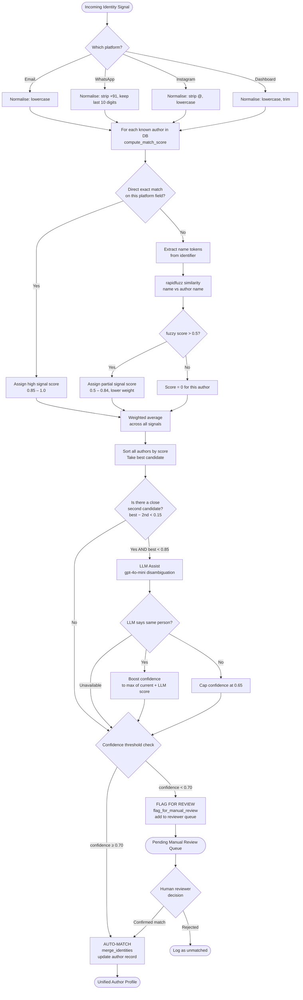

# Identity Unification System — Flowchart, Pseudocode & Confidence Scoring

BookLeaf Publishing receives contact from the same author across four platforms.
This document explains exactly how the system links them into one unified profile.

---

## The Problem

```
Email:         sara.johnson@xyz.com
WhatsApp:      +91 9876543210
Dashboard:     Sara J.
Instagram:     @sarapoetry23
```

These four strings come in at different times, from different channels.
No shared key. The system must figure out they are the same person.

---

## Mermaid Flowchart



---

## Pseudocode

```
FUNCTION unify_identity(incoming: PlatformIdentity, author_db: List[Author]):

    # ── Step 1: Normalise incoming identifier ──────────────────
    incoming.normalised = normalise(incoming.platform, incoming.value)
    #   email     → lowercase
    #   whatsapp  → strip country code, keep 10 digits
    #   instagram → strip @, lowercase
    #   dashboard → lowercase, trim

    # ── Step 2: Score against every known author ───────────────
    scores = []
    FOR each author IN author_db:
        (score, reasons) = compute_match_score(author, incoming)
        IF score > 0:
            scores.append( (score, author, reasons) )

    IF scores is empty:
        RETURN { matched: None, confidence: 0.0, needs_review: True }

    # ── Step 3: Sort and take best ─────────────────────────────
    scores.sort(descending by score)
    best_score, best_author, best_reasons = scores[0]

    # ── Step 4: LLM disambiguation on borderline cases ─────────
    IF len(scores) >= 2:
        second_score = scores[1].score
        IF best_score < 0.85 AND (best_score − second_score) < 0.15:
            llm_result = call_openai(
                identity_a = { name: best_author.name, email: best_author.email },
                identity_b = { platform: incoming.platform, value: incoming.value }
            )
            IF llm_result.same_person == True:
                best_score = max(best_score, llm_result.confidence)
            ELSE IF llm_result.same_person == False:
                best_score = min(best_score, 0.65)

    # ── Step 5: Threshold decision ─────────────────────────────
    IF best_score >= 0.70:
        merged = merge_identities(best_author, incoming)
        RETURN { matched: merged, confidence: best_score, needs_review: False }
    ELSE:
        entry = flag_for_manual_review(incoming, best_author, best_score)
        reviewer_queue.append(entry)
        RETURN { matched: None, confidence: best_score, needs_review: True }


FUNCTION compute_match_score(author, incoming) → (float, List[str]):

    signals = []   # list of (score, weight) tuples

    IF incoming.platform == "email":
        IF exact email match:
            signals.append( (1.0, weight=1.0) )
        ELSE:
            email_name = extract_name_from_local_part(incoming.email)
            score = fuzzy(email_name, author.name)
            IF score > 0.5:
                signals.append( (score, weight=0.6) )

    ELSE IF incoming.platform == "whatsapp":
        IF exact 10-digit match:
            signals.append( (1.0, weight=0.95) )
        ELSE IF last 8 digits match:
            signals.append( (0.85, weight=0.7) )

    ELSE IF incoming.platform == "instagram":
        IF exact handle match:
            signals.append( (1.0, weight=0.9) )
        ELSE:
            handle_name = strip_digits_and_symbols(incoming.handle)
            score = fuzzy(handle_name, author.name)
            IF score > 0.5:
                signals.append( (score, weight=0.55) )

    ELSE IF incoming.platform == "dashboard":
        IF exact name match:
            signals.append( (1.0, weight=0.85) )
        ELSE:
            score = fuzzy(incoming.name, author.dashboard_name)
            IF score > 0.5:
                signals.append( (score, weight=0.7) )

    IF signals is empty:
        RETURN (0.0, ["No matching signals"])

    confidence = weighted_average(signals)
    RETURN (confidence, reasons)
```

---

## Confidence Scoring — Detailed Explanation

### Signal Weights by Platform

Each platform contributes evidence with a different reliability weight,
reflecting how unique and trustworthy each identifier is:

| Platform | Match Type | Score | Weight | Rationale |
|---|---|---|---|---|
| Email | Exact match | 1.00 | 1.00 | Globally unique; highest trust |
| Email | Name derived from local part | fuzzy | 0.60 | Indirect; lower trust |
| WhatsApp | Exact 10-digit match | 1.00 | 0.95 | Near-unique in India |
| WhatsApp | Last-8-digits match | 0.85 | 0.70 | Possible number portability overlap |
| Instagram | Exact handle | 1.00 | 0.90 | Unique per platform |
| Instagram | Handle ≈ author name | fuzzy | 0.55 | Handles often unrelated to real names |
| Dashboard | Exact display name | 1.00 | 0.85 | Self-reported; possible aliases |
| Dashboard | Fuzzy name match | fuzzy | 0.70 | Abbreviations common (Sara J. = Sara Johnson) |

### Weighted Average Formula

```
confidence = Σ (signal_score × signal_weight)
             ───────────────────────────────
                    Σ signal_weight
```

**Example — Sara Johnson:**

```
Incoming: dashboard name = "Sara J."
Known author: dashboard_name = "Sara Johnson"

  fuzzy("sara j.", "sara johnson") = 0.82   (token_sort handles abbreviation)
  signal = (0.82, weight=0.70)

  confidence = (0.82 × 0.70) / 0.70 = 0.82

  0.82 ≥ 0.70 → AUTO-MATCH 
```

**Example — ambiguous Instagram handle:**

```
Incoming: instagram = "@sarapoetry23"
Known authors: "Sara Johnson" and "Sara Pillai" both score ~0.60

  best_score = 0.60, second_score = 0.58  → gap < 0.15
  LLM called with both candidates

  LLM: { same_person: true, confidence: 0.78, reasoning: "sarapoetry matches Sara Johnson's genre profile" }
  best_score = max(0.60, 0.78) = 0.78

  0.78 ≥ 0.70 → AUTO-MATCH with LLM boost 
```

**Example — unknown number:**

```
Incoming: whatsapp = "+91 9000000000"
No author matches → all scores = 0.0

  confidence = 0.0 < 0.70 → MANUAL REVIEW 
  review_reason = "Zero-confidence for all authors"
```

### Threshold Decision Tree

```
confidence ≥ 0.90  →  High-confidence auto-match (exact or near-exact)
confidence 0.70–0.89 →  Auto-match (fuzzy or LLM-confirmed)
confidence 0.50–0.69 →   MANUAL REVIEW — probable match but unconfirmed
confidence < 0.50  →   MANUAL REVIEW — likely different person or new author
confidence = 0.00  →  New/unknown author — create new profile or escalate
```

### Fuzzy Matching Algorithm (rapidfuzz)

The `_fuzzy_score` function blends three rapidfuzz metrics:

```python
score = max(ratio, token_sort_ratio) × 0.6  +  partial_ratio × 0.4
```

- **ratio** — standard Levenshtein distance ratio
- **token_sort_ratio** — handles word-order variations ("Sara J." vs "J Sara")
- **partial_ratio** — substring match (useful for "Sara" inside "Sara Johnson")

The 60/40 split prioritises full-string similarity while allowing partial credit
for substrings — important for abbreviated names like "R. Desai" → "Rohit Desai".

---

## Manual Review Queue Entry Format

When confidence < 0.70, an entry is added to the reviewer queue:

```json
{
  "incoming_platform": "instagram",
  "incoming_value": "@unknownwriter99",
  "best_candidate": "Priya Sharma",
  "best_candidate_email": "priya.sharma@gmail.com",
  "confidence": 0.42,
  "reasons": ["Instagram handle ≈ author name (score=0.42)"],
  "review_reason": "Confidence below 70% threshold",
  "status": "pending_review"
}
```

A human agent then:
1. Views the incoming identifier and the best candidate side-by-side
2. Clicks **Confirm** (triggers `merge_identities`) or **Reject** (logs as unmatched)
3. Optionally creates a new author profile

---

## Platform Coverage Matrix

| Author | Email | WhatsApp | Instagram | Dashboard | Unified? |
|---|---|---|---|---|---|
| Priya Sharma |  priya.sharma@ |  +91 9876543210 |  @priyawrites |  Priya S. |  |
| Arjun Mehta |  arjun.mehta@ |  +91 9123456789 |  @arjunmreads |  Arjun Mehta |  |
| Unknown |  — |  +91 9000000000 |  — |  — |  Manual |

---

*This document accompanies `identity_unifier.py` in the BookLeaf Publishing assignment submission.*
